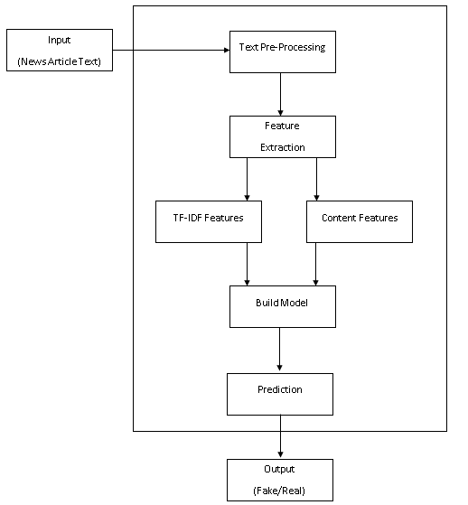

# Fake News Detection

## Introduction
Fake news is a critical issue in today's digital age, where information spreads rapidly through various online platforms. The circulation of fake news can have a significant negative impact on people and culture. This project leverages machine learning algorithms to automatically determine the authenticity of news articles. The project aims to develop a machine learning model that can identify any news article and classify it as fake or not. Three methods were used to determine the results of the model.
- Random Forest Classifier
- Passive Aggressive Classifier
- SVM Classifier

## Dataset
We have used [FakeNewsNet dataset](https://github.com/KaiDMML/FakeNewsNet) containing news articles along with their corresponding labels (1 or 0). The dataset is divided into two classes:                                                                                                
(1): True or Genuine news articles                                                                                                             
(0): Fake or fabricated news articles                                                                                                          
It containing two datasets, Politifact  and Gossipcop , that are collected from two news fact-checking websites. 
We just use 'Gossipcop news' with a total of 4190 "fake" tweets and 15089 "real" articles.

## Approach

## Results
We evaluated each classifier's performance using metrics such as accuracy, precision, recall, and F1 score. The results are documented in the project files.
